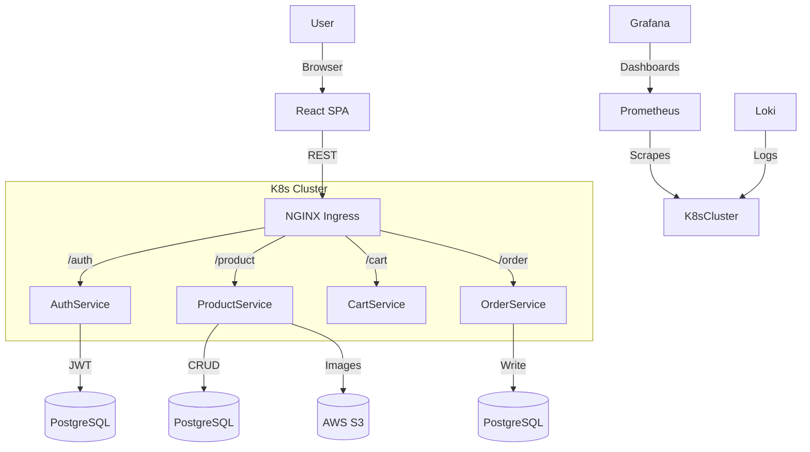

# CloudShop

(this does not work yet but im making it public to put pressure to finish itt the goal for this project is to learn how to use Devops/services )

CloudShop is a cloud-native e-commerce platform built to showcase modern DevOps, microservices, and cloud infrastructure skills. It features:
- Microservices architecture (auth, product, cart, order)
- Kubernetes orchestration (EKS-ready, manifests in /k8s)
- GitOps deployment with ArgoCD
- Infrastructure as Code (Terraform for AWS EKS, RDS, S3)
- Observability: Prometheus, Grafana dashboards, Loki logging
- End-to-end CI/CD with GitHub Actions

---

## 🏗️ Architecture



---

## 🚀 Quick Start

### 1. Clone and Install
```bash
git clone https://github.com/Zwin-ux/Devops-test.git
cd cloudshop
```

### 2. Local Development (Example: Auth Service)
```bash
cd services/auth
npm install
npm start
```

### 3. Run All Tests
```bash
npm test
```

### 4. Build & Run with Docker
```bash
docker build -t auth-service .
docker run -p 3000:3000 auth-service
```

### 5. Deploy to Kubernetes
```bash
kubectl apply -f k8s/
```

---

## 🧪 Testing & Automation
- Each service has Jest-based health and integration tests
- Example end-to-end test: `tests/integration/full-flow.test.js`
- Load testing scripts in `/tests/load/` (use [k6](https://k6.io/))

---

## 🔄 CI/CD Pipeline
- GitHub Actions: `.github/workflows/deploy.yml`
  - Lint, test, build, scan (Trivy), push Docker images
  - Update manifests and trigger ArgoCD sync

---

## 📊 Monitoring & Observability
- Prometheus scrapes service and pod metrics
- Grafana dashboards for API latency, errors, business metrics
- Loki collects and centralizes logs (JSON format)
- Alertmanager sends alerts (e.g. to Discord) if healthchecks fail

---

## 🛠️ Infrastructure as Code
- `/infra` contains Terraform scripts for AWS EKS, RDS, S3, IAM, VPC
- Example usage:
```bash
cd infra
terraform init
terraform plan
terraform apply
```

---

## 🧑‍💻 Contributing
1. Fork the repo and create a feature branch
2. Add or update tests for your changes
3. Open a pull request with a clear description

---

## 📚 References
- [Kubernetes Docs](https://kubernetes.io/docs/)
- [ArgoCD GitOps](https://argo-cd.readthedocs.io/)
- [Terraform AWS Provider](https://registry.terraform.io/providers/hashicorp/aws/latest/docs)
- [Prometheus](https://prometheus.io/docs/), [Grafana](https://grafana.com/docs/)
- [Istio Service Mesh](https://istio.io/latest/docs/)

---

## 🏆 What’s ATTEMPTED to b e  Implemented (i suck :( )
- Multi-stage Dockerfiles, non-root users, healthchecks
- K8s manifests with liveness/readiness probes, Ingress, Istio, Secrets
- CI/CD with test, lint, build, scan, push, and deploy
- Monitoring dashboards and alerting configs
- Full test suites (unit, integration, load)
- Production documentation and usage examples

---

## 👀 Live Demo
_Deploy to your own AWS/GCP cluster or reach out for a demo link!_
